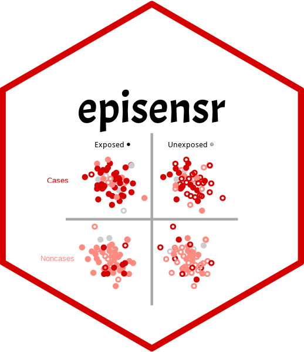

<!-- README.md is generated from README.Rmd. Please edit that file -->

# apisensr 

<!-- badges: start -->

[](https://travis-ci.org/dhaine/apisensr)
[](https://cran.r-project.org/package=apisensr)
[](https://doi.org/10.XXXX/zenodo.XXXXXX)
[](https://www.repostatus.org/#wip)

<!-- badges: end -->

**apisensr** provides an interactive web app for the R package
[**episensr**](https://cran.r-project.org/package=episensr). The R
package **episensr** allows to do basic sensitivity analysis of
epidemiological results as described in **Applying Quantitative Bias
Analysis to Epidemiological Data** by Timothy L. Lash, Matthew P. Fox,
and Aliza K. Fink (ISBN: 978-0-387-87960-4,
[bias.analysis](https://sites.google.com/site/biasanalysis/)).

## License

This package is free and open source software, licensed under MIT.

## Citation

To cite **apisensr**, please use:

``` r
citation("episensr")
#> 
#> To cite episensr in publications use:
#> 
#>   Haine, Denis (2021). The episensr package: basic sensitivity analysis
#>   of epidemiological results. R package version 1.0.0.
#>   https://dhaine.github.io/episensr/. doi: 10.5281/zenodo.4554554.
#> 
#> A BibTeX entry for LaTeX users is
#> 
#>   @Misc{,
#>     title = {The episensr package: basic sensitivity analysis of epidemiological results},
#>     author = {Denis Haine},
#>     year = {2021},
#>     note = {R package version 1.0.0},
#>     doi = {10.5281/zenodo.4554554},
#>     url = {https://dhaine.github.io/episensr/},
#>   }
```

## Installation

You can install the master version from CRAN or the development version
from [GitHub](https://github.com/dhaine/apisensr) with:

``` r
#install.packages("remotes")
remotes::install_github("dhaine/apisensr", ref = "develop")
```

## How to run apisensr

``` r
library(apisensr)
run_app()
```

Please note that the ‘apisensr’ project is released with a [Contributor
Code of Conduct](CODE_OF_CONDUCT.md). By contributing to this project,
you agree to abide by its terms.
