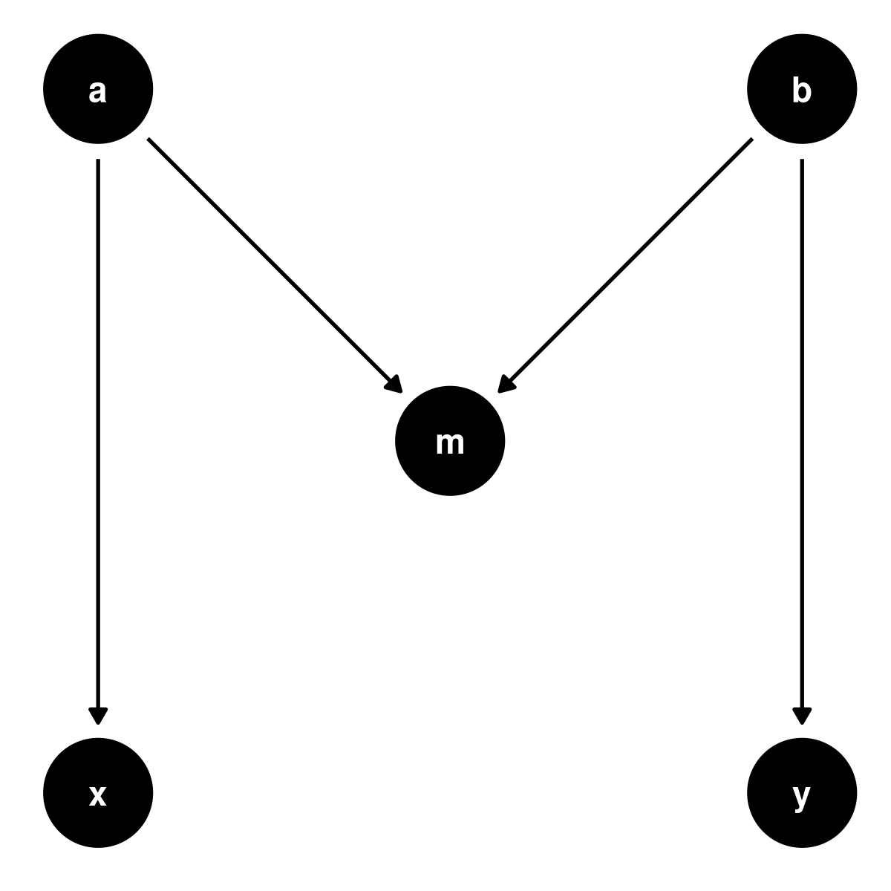

M-bias is the bias introduced by conditioning on a collider that has no causal
association with exposure or outcome, but is indirectly associated with both
trough ancestors (causes) of exposure and disease.

In the **Analysis tab**, provide the odds ratio between exposure, outcome,
collider, and ancestors:

- Odds ratio between A and the exposure X,
- Odds ratio between A and the collider M,
- Odds ratio between B and the collider M,
- Odds ratio between B and the outcome Y,
- Odds ratio observed between the exposure X and the outcome Y.

The data for the example provided come from:

- Greenland S. Quantifying biases in causal models: classical confounding vs.
  collider-stratification bias. Epidemiology 2003;14:300-6.
